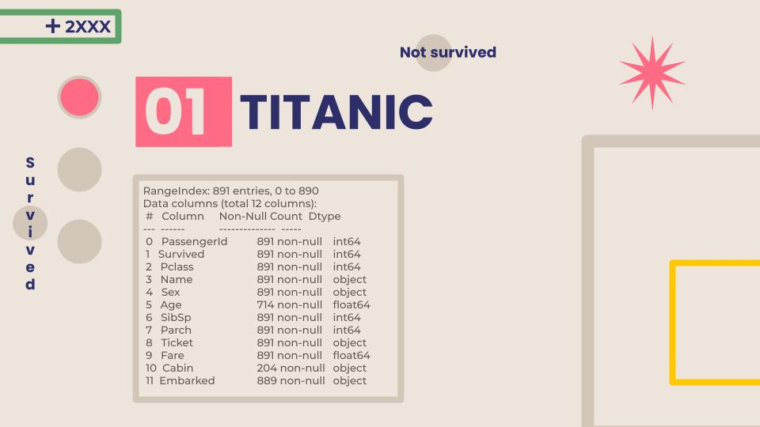

# Machine learning from disaster
Desafio do Titanic já é um clássico do Kaggle. O famoso desafio é o que eles indicam como o primeiro desafio para entrar no mundo do aprendizado de máquina. Para se familiarizar tanto com a plataforma como com técnicas de ciência de dados.  

O desafio consiste em predizer quais passageiros sobreviveram ao desastre do Titanic. O dataset consiste em 10 colunas com dados reais dos passageiros que estiveram a bordo do navio que afundou em 1909.  

Dê uma olhada na minha análise [aqui nesse notebook](notebooks/titanic.ipynb).